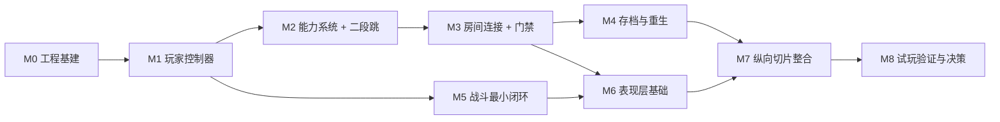

# Metroidvania 2D 玩法验证路线图

> 阶段目标：**用最小成本验证核心玩法闭环**——"探索 → 遇到能力门 → 获得新能力 → 回溯通过"。
> 验证期一切决策以「手感」和「闭环体验」为优先级；美术与音频本期只做到"能接入、够用"的基本水平，内容量、高级表现与系统复杂度全部延后。

## 一、先做哪几个系统（结论）

| 顺序 | 系统 | 为什么排在这个位置 | 验证的问题 |
|---|---|---|---|
| 1 | 玩家控制器（移动/跳跃/状态机） | 全游戏地基，手感 90% 由它决定 | 操作是否跟手 |
| 2 | 能力系统 + 首个能力（二段跳） | 银河城的灵魂是"能力解锁改变世界" | 拿到能力是否有"世界变了"的感觉 |
| 3 | 房间连接 + 门禁设计 | 验证"过不去 → 变强 → 回来通过" | ★全游戏最需要验证的假设★ |
| 4 | 存档与重生 | 没有存档，完整体验无法复现 | 流程能否中断恢复 |
| 5 | 战斗最小闭环（1 种攻击 + 1 种敌人） | 相对独立，可后置或并行 | 打击感/危险感是否成立 |
| 6 | 表现层基础（初步美术与音频接入） | 把占位系统接上真实资源管线，达到基本表现水平 | 图片/动画/音频能否顺畅接入 |
| 7 | 纵向切片整合（8~10 个房间） | 把系统串成一条真实流程 | 整体节奏与迷路感 |

**验证期明确不做**：小地图、多能力组合谜题、装备/技能树、复杂敌人 AI、剧情对话系统、商店、成就；表现层面不做多层视差背景、后处理与着色器特效、动态音乐混音，正式原创美术延后（本期用色块或免费素材占位）。

## 二、里程碑详情

### M0 工程基建（约 0.5~1 天）
- **Input Map**：move_left / move_right / jump / attack / dash / interact（后两个先预留）。
- **项目设置**（stretch 模式 canvas_items + expand 已配好；补窗口尺寸，基准 1920×1080，非像素风纹理过滤保持默认「线性」，不做像素对齐）：
  ```
  display/window/size/viewport_width = 1920
  display/window/size/viewport_height = 1080
  ```
- **目录结构建议**：
  ```
  res://
  ├── Assets/
  │   ├── Sprites/          # 角色、敌人、图块、背景、UI 图片（png）
  │   ├── Audio/
  │   │   ├── BGM/          # 背景音乐（ogg，循环友好）
  │   │   └── SFX/          # 音效（wav，低延迟）
  │   └── Fonts/            # 可商用字体
  ├── Scenes/
  │   ├── Player/
  │   ├── Enemies/
  │   ├── Rooms/
  │   └── UI/
  ├── Scripts/
  │   ├── Player/
  │   ├── Systems/
  │   └── Autoload/         # 全局单例脚本
  └── Resources/            # 后续能力的 .tres 等数据资源
  ```
- **Autoload 单例**：GameManager（全局状态/事件）、SaveManager（存档）；AudioManager 在 M6 表现层阶段新增，不提前建。
- 搭一个**灰盒测试房间**（TileMapLayer 或纯色 StaticBody2D）。

**验收**：项目可运行，有一个只有碰撞体的测试房间可走动。

### M1 玩家控制器（约 3~7 天）★最重点
**功能清单（按优先级）**：
1. 水平移动：加速度 / 减速度 / 最大速度（全用 @export 暴露方便调参）；
2. 跳跃：可变高度（松开跳键矮跳）、上升/下落分段的独立重力；
3. 手感三件套：Coyote Time（离地宽限）、Jump Buffer（落地前预输入）、单向平台；
4. 简单状态机：Idle / Run / Jump / Fall（验证期用 enum 就够，不必上节点式状态机）；
5. 摄像机：Camera2D 平滑跟随 + 死区，可选前瞻偏移（Metroidvania 中相机质量很影响体验）；
6. 动画真管线占位：AnimatedSprite2D + SpriteFrames，四组状态动画（Idle/Run/Jump/Fall）与状态机联动，素材先用免费资源或色块帧，M6 直接换图。

**验收**：在灰盒房间里连续移动跳跃 30 秒"不难受"；找朋友盲测，对比《空洞骑士》的手感差距能说清差在哪。

### M2 能力系统 + 二段跳（约 2~4 天）
- **能力框架（关键设计决策）**：验证期用 PlayerAbilities 节点 + bool 标志最省事，但**接口要预留**：
  - `unlock_ability(id)` / `has_ability(id)` / 信号 `ability_unlocked(id)`
  - 后续可平滑升级为 Resource 定义（每个能力一个 .tres：id、名称、图标）。
- **AbilityPickup 场景**：Area2D 检测玩家 → 拾取演出（短暂定帧/光圈/文字）→ 解锁 → 记录。
- **调试辅助**：加一个快捷键直接切换能力解锁状态，方便反复对比验证。

**验收**：调试键与拾取物都能解锁；解锁前后二段跳的行为差异明显。

### M3 房间连接与门禁（约 2~4 天）★核心验证
- **房间 = 独立场景**，边缘 Area2D 触发切换，Marker2D 定义各方向出生点；
- **过渡**：CanvasLayer + ColorRect 淡入淡出（Tween 实现）即可；
- **门禁设计原则**：每种障碍只用一种能力的"考题"来卡——高台/深坑 → 二段跳；窄缝 → 滑铲（未解锁）；裂缝 → 冲刺（未解锁）；
- **建造最小验证关卡（5 个房间）**：
  1. 出生房（基础移动教学）；
  2. 障碍房 A：高处放一个明显可见但拿不到的道具；
  3. 能力房：小挑战 → 拾取二段跳；
  4. 回到障碍房 A，用二段跳通过；
  5. 终点房：占位"恭喜"或迷你 Boss。

**验收**：★完整走通"过不去 → 拿到能力 → 回来过去"，确认是否有"啊哈"时刻。这是整个验证阶段最重要的检查点。★

### M4 存档与重生（约 1~2 天）
- 存档点（长椅/存档房）：交互 → 回血 → 记录；配套死亡重生逻辑；
- SaveManager：用 JSON 存 `user://save.json`，内容为 `{玩家位置, 已解锁能力[], 已拾取物[], 存档点 ID}`。

**验收**：存档 → 关闭游戏 → 重开 → 位置与能力完整保留。

### M5 战斗最小闭环（约 3~5 天）
- **玩家攻击**：先做一种（近战挥砍或远程，看题材），含前摇/判定/后摇；
- **受击反馈体系**：Hitbox/Hurtbox（Area2D 碰撞层）、无敌帧、击退、顿帧（加分项）；
- **一个敌人**：状态机 巡逻 → 察觉 → 追击 → 攻击 → 受击 → 死亡（只做 1 种，做扎实）；
- 玩家死亡联动 M4 重生；
- 强烈建议加简单屏幕震动与音效——打击感的一半来自反馈而非动画。

**验收**：打 30 秒敌人不无聊；被打死时玩家能明确知道"我哪里错了"。

### M6 表现层基础：初步美术与音频接入（约 3~5 天）
**目标**：把占位系统接上真实资源管线，达到"基本表现水平"——图片、动画、音效、BGM 全链路可用；多层背景与复杂特效留给后续。

- **音频接入（新增 AudioManager 单例）**：
  - 总线布局：Master → BGM / SFX 两条（后续再扩 UI/环境音与效果器）；
  - 接口：`play_sfx(name)` / `play_bgm(name)`（同一首 BGM 不重复播放，切换带短淡入淡出）；
  - 触发点：跳跃、攻击、受击、拾取、死亡等 SFX；BGM 跟随 M3 的房间切换（每房间/每区域一首）；
- **图片与动画接入**：
  - 玩家与敌人保持 AnimatedSprite2D + SpriteFrames 方案，把占位帧替换为初步素材（免费素材或自制）；
  - 底线：**替换素材时零代码改动、零碰撞体调整**，以此验证 M1 定下的帧尺寸与锚点规范；
- **背景层（初步）**：每个房间 1 层背景（Sprite2D 或 Parallax2D 单层），结构上预留后续远/中/近多层的挂点；
- **特效基础（初步）**：复用 M5 的摄像机震动与受击顿帧，补一个命中一次性粒子（GPUParticles2D）即可；不做后处理与着色器；
- **字体与 UI**：HUD 引入可商用字体，UI 图片先用色块 + 文字。

**验收**：替换素材后碰撞与锚点零调整；跳跃、攻击、受击、拾取、死亡均有音效；BGM 随房间切换平滑、无爆音；背景与前景有基本层次对比。

### M7 纵向切片整合（约 2~3 天）
- 把 M3、M5、M6 的成果串成 10~15 分钟流程；补 HUD（血量 + 已获得能力）；
- 终点加一个小演出（占位即可）。

**验收**：找一个没参与开发的人独立玩通，全程只观察不提示，记录他卡在哪、吐槽最多的是什么。

### M8 试玩验证与决策（约 1 天）
- 归纳三类问题：迷路点、手感卡点、无聊点；
- 决策：进入正式制作扩内容 / 优先重做手感 / 调整核心玩法假设。

## 三、里程碑依赖关系



M4 与 M5 可以调序或并行；M6 表现层基础依赖 M3（房间背景与 BGM 挂点）和 M5（战斗音效与特效触发点）；其余建议按序推进。

## 四、美术与音频资源策略（初步）

> 风格基线：**非像素风（HD/手绘）**，基准分辨率 1920×1080；纹理过滤保持默认「线性」，不做像素对齐；素材尺寸无网格约束。所有素材替换以"零代码改动"为底线。

- **图片**：`Assets/Sprites/` 按用途分文件夹（角色/敌人/图块/背景/UI），PNG 格式（LFS 已管理）；
- **音频**：BGM 用 ogg（循环友好、体积小），SFX 用 wav（低延迟），分放 `Assets/Audio/BGM/` 与 `Assets/Audio/SFX/`；
- **字体**：`Assets/Fonts/`，只收可商用授权字体；
- **源文件**：psd/aseprite/blend 等如需入库走已配置的 LFS 锁定轨道（防止多人同时编辑冲突）。

**表现层分级（本期做左列；右列留给后续正式制作）**：

| 表现层 | 本期（初步，达到基本水平） | 后续增强 |
|---|---|---|
| 背景 | 每房间 1 层背景，预留多层结构 | 远/中/近多层视差、前景景深层、区域主题化 |
| 角色/敌人动画 | AnimatedSprite2D + 帧序列 + 初步素材 | 更细腻的动画与演出，评估骨骼动画（Skeleton2D） |
| 特效 | 摄像机震动、受击顿帧、命中粒子（单个） | 屏幕后处理、着色器特效、粒子库、过场演出 |
| 音频 | AudioManager + BGM/SFX 双总线、房间 BGM | 动态音乐（垂直分层）、环境音、混音处理、音效随机变体 |
| UI | 基础 HUD（血量/能力），占位字体 | 完整菜单、设置、暂停与存档 UI、正式字体与图标 |

**可插拔原则（为后续扩展留路）**：背景从单层升级为多层视差时只加节点不改代码；音效从"播名字"升级为变体/随机音高时只改 AudioManager 内部、调用方不动；特效升级为后处理时新增独立 CanvasLayer/节点，不侵入战斗逻辑。

## 五、贯穿全程的工程约定
- 所有手感参数用 `@export` 暴露，调参是验证期的日常工作；
- 场景保持小且独立：Player / Enemy / Room 各自独立场景，可单独按 F6 调试；
- 用信号解耦：能力解锁、死亡、拾取等事件广播给 HUD 与存档；
- 占位美术统一风格（色块或免费素材），非像素风、按 1920×1080 基准制作，验证期不画正式美术；
- 素材访问走"资源引用 + 名字"（动画帧、音效名），不把素材细节写死进逻辑，保证替换零代码改动；
- 每完成一个里程碑做一次小提交（Git LFS 已配置就绪）。

## 六、时间预算与风险
- **全职**：约 4~5 周；**业余每天 2~3 小时**：约 8~12 周；
- 最易超时的是 M1 手感打磨、M3 关卡片区设计与 M6 素材筛选接入，给这三个里程碑留 buffer；
- M1 设定"够用"标准（验收通过即冻结），避免陷入完美主义；
- M6 挑选素材是无底洞：每个素材环节设时间盒（如单次不超过 1 小时），够用即停；
- 每个里程碑完成后邀请朋友试玩 15 分钟，验证心态贯穿始终。

## 七、对后续扩展的预留
验证通过后按此顺序扩展：更多能力（冲刺/滑铲/攀墙）→ 多层视差背景与区域美术主题 → 特效增强（后处理/着色器/粒子库）→ 动态音乐与混音 → 更多敌人与 Boss → 小地图 → 剧情与 NPC → 正式美术与 UI 全面替换。